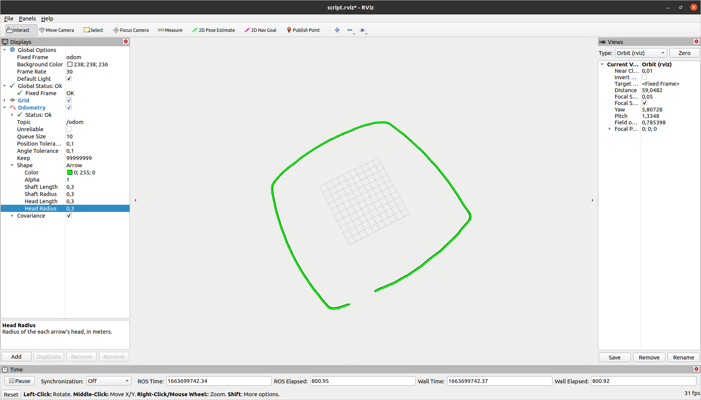

# KURULUM

Workspace Hazırlanışı

```
mkdir odom_ws/src
cd odom_ws
mkdir src
cd src
git clone https://github.com/huseyintutan/itu_rover_odom.git
cd ..
catkin build

source odom_ws/devel/setup.bash

sudo chmod +x src/timestamper/scripts/timestamp.py


```
# ÇALIŞTIRMA
roslaunch iturover_odometry_assignment rosbag.launch 
rosrun timestamper timestamp.py
rviz
```

### ÖRNEK ÇIKTI GÖRÜNTÜSÜ
<div align="center">

</div>
